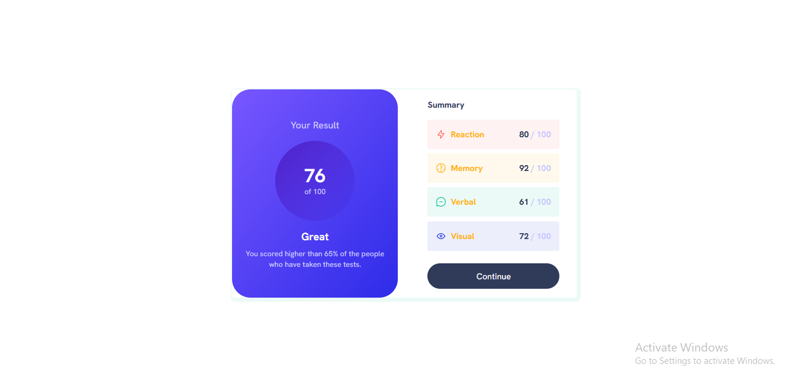

# Frontend Mentor - Results summary component solution

This is a solution to the [Results summary component challenge on Frontend Mentor](https://www.frontendmentor.io/challenges/results-summary-component-CE_K6s0maV). Frontend Mentor challenges help you improve your coding skills by building realistic projects.

## Table of contents

- [Overview](#overview)
  - [The challenge](#the-challenge)
  - [Screenshot](#screenshot)
  - [Links](#links)
- [My process](#my-process)
  - [Built with](#built-with)
  - [What I learned](#what-i-learned)
  - [Continued development](#continued-development)
- [Author](#author)

## Overview

### The challenge

Users should be able to:

- View the optimal layout for the interface depending on their device's screen size
- See hover and focus states for all interactive elements on the page

### Screenshot



### Links

- Solution URL: [Click Here](https://www.frontendmentor.io/solutions/responsive-results-summary-component-page-built-using-react-tailwind-lFSj4aXNx7)
- Live Site URL: [Click Here](https://summary-component-main.netlify.app/)

## My process

### Built with

- Semantic HTML5 markup
- CSS custom properties
- Flexbox
- CSS Grid
- Mobile-first workflow
- [TailwindCSS](https://tailwindcss.com/) - CSS Framework
- [React](https://reactjs.org/) - JS library

### What I learned

I just started learning about React and I'm loving it already. I decided to put myself to test building this project to flex the new skill I've learnt.
One key thing I'm proud of that I learnt and I also implemented in this challenge is rendering html contents dynamically to the DOM.
I'm also working on getting better at animations so I implemented a simple slide-in animation in this challenge as well for the summary component datas.

```css
.summary--component1 {
  background-color: hsla(0, 100%, 67%, 0.08);
  opacity: 0;
  visibility: hidden;
  animation: slider 1s ease-in 400ms forwards;
}

.summary--component2 {
  background-color: hsla(39, 100%, 56%, 0.08);
  opacity: 0;
  visibility: hidden;
  animation: slider 1s ease-in 800ms forwards;
}

.summary--component3 {
  background-color: hsla(166, 100%, 37%, 0.08);
  opacity: 0;
  visibility: hidden;
  animation: slider 1s ease-in 1200ms forwards;
}

.summary--component4 {
  background-color: hsla(234, 85%, 45%, 0.08);
  opacity: 0;
  visibility: hidden;
  animation: slider 1s ease-in 1600ms forwards;
}

@keyframes slider {
  0% {
    transform: translateX(100%);
    opacity: 0;
    visibility: visible;
  }

  100% {
    transform: translateX(0%);
    opacity: 1;
    visibility: visible;
  }
}
```

```js
export default function Summary() {
  const dataObj = data.map((dataEl, i) => {
    return (
      <div className={`summary--component${i + 1} flex items-center justify-between p-4 rounded mb-2`} key={i + 1}>
        <div className="summary--component__detail flex items-center">
          
          <p className="ml-2 font-bold text-orangeYellow">{dataEl.category}</p>
        </div>

        <div className="detail--score flex items-center gap-1">
          <span className="text-darkGrayBlue font-bold">{dataEl.score}</span>
          <span className="text-lightLavender font-bold">/</span>
          <span className="text-lightLavender font-bold">100</span>
        </div>
      </div>
    );
  });

  return (
    <section className="summary mx-8">
      <p className="text-darkGrayBlue text-base font-bold my-4">Summary</p>
      {dataObj}
      <button className="bg-darkGrayBlue w-full py-3 text-white rounded-full my-4">Continue</button>
    </section>
  );
}
```

### Continued development

Since I just started learning React, I'll have to keep improving because it's a really powerful JS library.

## Author

- Website - [Abdullah Ayoola](https://github.com/abdullah43577)
- Frontend Mentor - [@abdullah43577](https://www.frontendmentor.io/profile/abdullah43577)
- Twitter - [@officialayo540](https://twitter.com/officialayo540)
